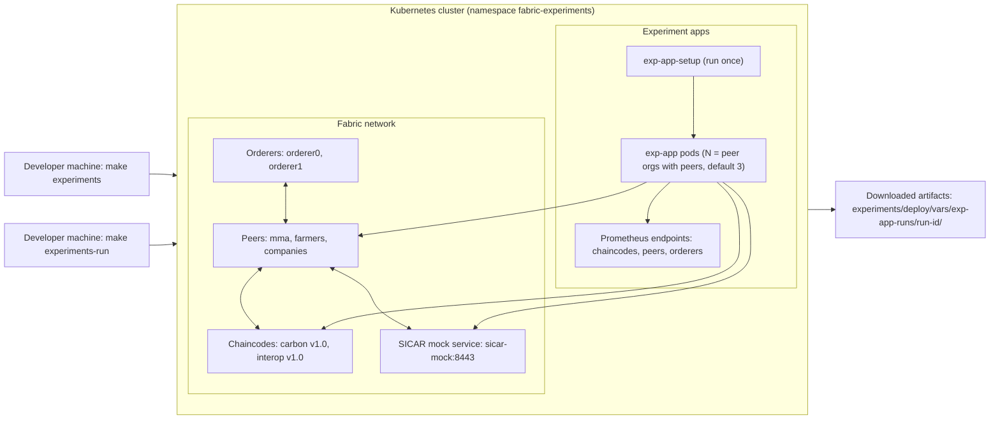

# Experiments

This directory contains the deployment and workload tooling for BETS performance experiments on Minikube and AKS.

## Current Execution Cycle

1. Deploy Fabric network + chaincodes + in-cluster exp-app pods:

```bash
make experiments
```

2. Run experiment cycle (global setup once, then all exp-app pods concurrently, then download artifacts):

```bash
make experiments-run
```

3. Results are downloaded to:

```text
experiments/deploy/vars/exp-app-runs/<run-id>/<pod>/
```

## Topology And Flow



Each pod directory contains:

- `results.json` and `results.csv` (aggregate runtime metrics in that pod)
- `results.json.user-XX` and `results.csv.user-XX` (per-runtime metrics)
- `monitoring-exports/` with:
  - `metrics-baseline.json`
  - `metrics-final.json`
  - `metrics-delta.json`
  - `metrics-report.json` (if requested)
  - `report.html`
  - `report.pdf` (if requested)
  - `charts/*.png`

## Important Design Notes

- Global setup is separated from workload execution:
  - `exp-app-setup` performs one-time global operations (`Init`, SICAR trusted provider, active policies, TEE setup).
  - `exp-app` performs identity-scoped setup and workload only.
- Multi-pod execution is concurrent after global setup.
- Metrics collection includes Fabric and chaincode Prometheus endpoints plus app-side runtime metrics.
- Chaincode function metrics are collected by function name labels (`tx_name`, with fallback support for older labels).

## Useful Variables for `experiments-run`

`make experiments-run` uses `experiments/deploy/scripts/run_exp_app_experiments.bash`. Common overrides:

```bash
NAMESPACE=fabric-experiments \
DURATION=10m \
CONCURRENCY=30 \
METRICS_FORMATS=png,html,pdf,json \
RUN_GLOBAL_SETUP=true \
SETUP_USER_INDEX=0 \
make experiments-run
```

Other available knobs include `TPS`, `BURST`, `USER_COUNT`, `MINT_INTERVAL`, `BUY_BID_INTERVAL`, `SELL_BID_INTERVAL`, `AUCTION_INTERVAL`.

## Cleanup

```bash
make experiments-clean
```
